# Monitoreo de API con Prometheus y Grafana

## Información del estudiante

**Nombre:** Laura Daniela Lopez Santos

**Codigo:** 202220007601 

**Repositorio:** https://github.com/laurad30lopezs10/monitoreo-api 

**Link video:** 

**Materia:** Desarrollo de aplicaciones en la nube 

**Actividad:** BONUS - Monitoreo y observabilidad en la nube

# Índice

1. [Descripción del proyecto](#descripción-del-proyecto)
2. [Arquitectura del proyecto](#arquitectura-del-proyecto)
3. [Estructura del proyecto](#estructura-del-proyecto)
4. [Tecnologías utilizadas](#tecnologías-utilizadas)
5. [Endpoints de la API](#endpoints-de-la-api)
6. [Métricas implementadas](#métricas-implementadas)
7. [Configuración de Prometheus](#configuración-de-prometheus)
8. [Dashboard de Grafana](#dashboard-de-grafana)
9. [Script de tráfico sintético](#script-de-tráfico-sintético)
10. [Instrucciones de uso](#instrucciones-de-uso)
11. [Acceso a los servicios](#acceso-a-los-servicios)
12. [Credenciales de Grafana](#credenciales-de-grafana)
13. [Evidencias del proyecto](#evidencias-del-proyecto)
14. [Flujo de monitoreo](#flujo-de-monitoreo)
15. [Resultados obtenidos](#resultados-obtenidos)
16. [Posibles mejoras](#posibles-mejoras)
17. [Conclusión](#conclusión)

# Descripción del proyecto

Este proyecto implementa un sistema completo de monitoreo y observabilidad utilizando:

- Docker y Docker Compose
- API REST
- Prometheus
- Grafana
- Métricas en tiempo real
- Tráfico sintético automatizado

La solución permite visualizar métricas de rendimiento de una API REST instrumentada con Prometheus, recolectarlas mediante Prometheus Server y analizarlas gráficamente desde Grafana.

# Arquitectura del proyecto

El sistema está compuesto por 3 servicios principales:

## 1. API REST

- Expone diferentes endpoints.
- Genera métricas en formato Prometheus.
- Simula distintos tipos de tráfico y tiempos de respuesta.

## 2. Prometheus

- Recolecta métricas automáticamente desde el endpoint `/metrics`.
- Ejecuta consultas PromQL.

## 3. Grafana

- Visualiza las métricas mediante dashboards.
- Permite analizar throughput, latencia y comportamiento de la API.

# Estructura del proyecto

```bash
monitoreo-api/
│
├── api/
│   ├── Dockerfile
│   ├── package.json
│   ├── server.js
│   └── ...
│
├── prometheus/
│   └── prometheus.yml
│
├── scripts/
│   └── generate-traffic.sh
│
├── docker-compose.yml
├── README.md
└── .gitignore
```

---

# Tecnologías utilizadas

| Tecnología | Descripción |
|---|---|
| Docker | Contenedores para cada servicio |
| Docker Compose | Orquestación de servicios |
| Node.js | Backend de la API |
| Express | Framework para la API REST |
| Prometheus | Recolección de métricas |
| Grafana | Visualización y dashboards |
| Prom-client | Instrumentación de métricas |

# Endpoints de la API

| Método | Endpoint | Descripción |
|---|---|---|
| GET | `/` | Endpoint principal |
| GET | `/api/datos` | Retorna datos rápidos |
| GET | `/api/lento` | Simula procesamiento lento |
| GET | `/metrics` | Expone métricas Prometheus |

# Métricas implementadas

## 1. Contador de requests

Permite conocer el número total de solicitudes realizadas a cada endpoint.

## 2. Latencia de requests

Mide el tiempo de respuesta de cada endpoint.

## 3. Requests activos

Gauge utilizado para conocer cuántas solicitudes están activas simultáneamente.

## 4. Métricas del sistema

Se monitorea el comportamiento general de la aplicación y los contenedores.

# Configuración de Prometheus

Archivo:

```bash
prometheus/prometheus.yml
```

Configuración principal:

```yaml
global:
  scrape_interval: 15s

scrape_configs:
  - job_name: 'api'
    static_configs:
      - targets: ['api:3000']
```

Prometheus recolecta métricas automáticamente desde:

```bash
http://api:3000/metrics
```

# Dashboard de Grafana

El dashboard contiene paneles para:

- Requests por segundo
- Latencia promedio
- Total de requests
- Requests por endpoint
- Estado general del sistema

## Queries PromQL utilizadas

### Requests por segundo

```promql
rate(http_requests_total[10m])
```

### Latencia promedio

```promql
rate(http_request_duration_seconds_sum[10m]) /
rate(http_request_duration_seconds_count[10m])
```

### Requests por endpoint

```promql
sum by (endpoint) (rate(http_requests_total[10m]))
```

# Script de tráfico sintético

El proyecto incluye un script que genera tráfico automático para visualizar métricas en tiempo real.

Ejemplo:

```bash
./generate-traffic.sh
```

El script realiza solicitudes periódicas a:

- `/`
- `/api/datos`
- `/api/lento`

Esto permite observar cambios en:

- Throughput
- Latencia
- Número de requests

# Instrucciones de uso

## 1. Clonar el repositorio

```bash
git clone https://github.com/laurad30lopezs10/monitoreo-api.git
```

Entrar al proyecto:

```bash
cd monitoreo-api
```

## 2. Ejecutar Docker Compose

```bash
docker-compose up --build
```

O en segundo plano:

```bash
docker-compose up -d --build
```

## 3. Verificar los servicios

```bash
docker-compose ps
```

# Acceso a los servicios

Por medio de los siguientes links se puede acceder a todos los servicios

| Servicio | URL |
|---|---|
| API | http://localhost:3000 |
| Métricas | http://localhost:3000/metrics |
| Prometheus | http://localhost:9090 |
| Grafana | http://localhost:3001 |


# Credenciales de Grafana

```bash
Usuario: admin
Contraseña: Aa123456
```

# Evidencias del proyecto

A continuación se muestran las evidencias del desarrollo e implementación del sistema de monitoreo utilizando Docker, Prometheus y Grafana.

# Paso 1 - Creación del repositorio

En esta imagen se muestra la creación del repositorio en GitHub donde se almacenó todo el proyecto.

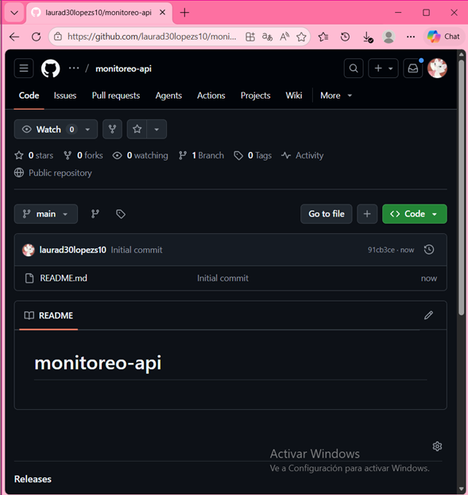

# Paso 2 - Clonación del repositorio

Aquí se observa el proceso de clonar el repositorio desde GitHub al entorno local para iniciar el desarrollo.

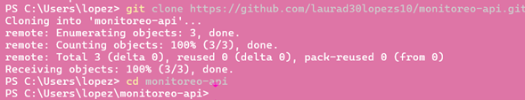

# Paso 3 - Estructura del proyecto

La siguiente imagen muestra la organización de carpetas y archivos utilizados para el proyecto, incluyendo la API, configuración de Prometheus y scripts.

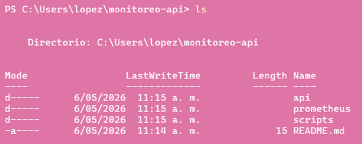

# Paso 4 - Configuración de la API

En esta etapa se realizó la configuración de la API REST y la instrumentación de métricas para Prometheus.

La API cuenta con distintos endpoints y expone métricas mediante `/metrics`.

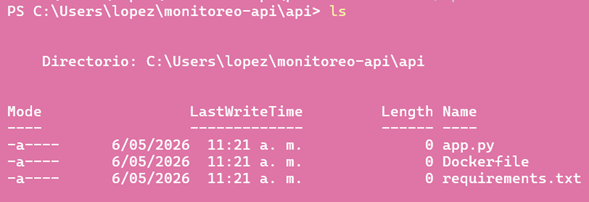

# Paso 5 - Configuración de Prometheus

Aquí se muestra la configuración realizada en el archivo `prometheus.yml`, donde se define el scraping automático de métricas desde la API.


# Paso 6 - Configuración de Grafana

En esta imagen se observa la configuración inicial de Grafana y la conexión con Prometheus como fuente de datos.

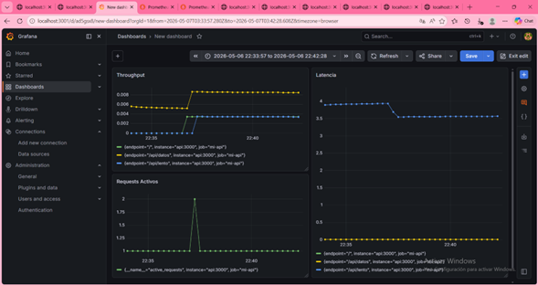

# Paso 7 - Ejecución de Docker Compose

La siguiente evidencia muestra la ejecución de `docker-compose`, iniciando todos los servicios necesarios para el monitoreo.

Servicios ejecutados:

- API
- Prometheus
- Grafana

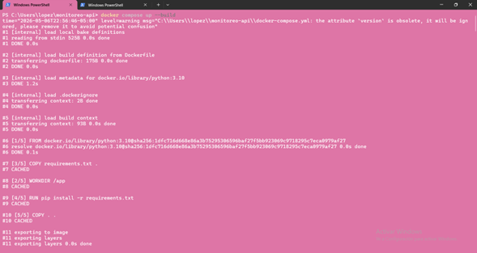

# Paso 8 - Verificación de versiones y servicios

En esta etapa se verificó que Docker, Docker Compose y los servicios estuvieran funcionando correctamente.

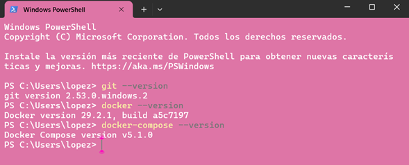

# Paso 9 - Pruebas de funcionamiento de la API

Aquí se realizan pruebas sobre los endpoints de la API para comprobar su correcto funcionamiento.

Endpoints probados:

- `/`
- `/api/datos`
- `/api/lento`

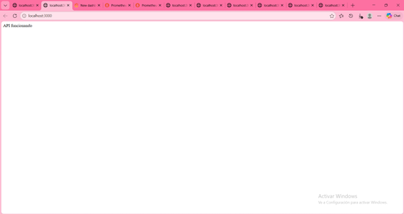

# Paso 10 - Verificación de métricas

La siguiente imagen muestra el endpoint `/metrics`, donde la API expone todas las métricas recolectadas en formato Prometheus.

Estas métricas incluyen:

- Total de requests
- Latencia
- Requests activos
- Métricas del sistema

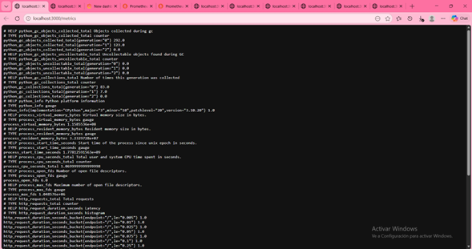

# Paso 11 - Configuración de Prometheus en Grafana

Aquí se muestra la integración de Prometheus como fuente de datos dentro de Grafana.

Esto permite construir dashboards con métricas en tiempo real.


# Paso 12 - Configuración de scripts y automatización

En esta etapa se desarrollaron scripts para generar tráfico sintético y automatizar pruebas sobre la API.

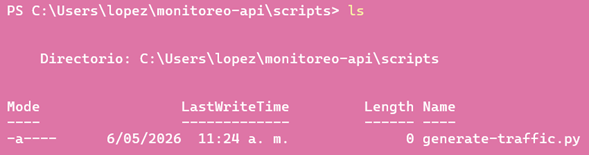

# Paso 13 - Configuración adicional de Prometheus

La siguiente evidencia muestra archivos complementarios utilizados para mejorar la configuración del monitoreo.

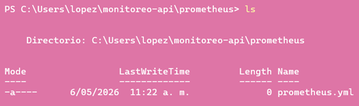

# Resultado final

Finalmente, se logró implementar un sistema completo de monitoreo y observabilidad en la nube utilizando Docker, Prometheus y Grafana.

El sistema permite:

- Monitorear métricas en tiempo real
- Analizar latencia y throughput
- Visualizar dashboards
- Generar tráfico sintético
- Observar el comportamiento de la API

# Flujo de monitoreo

1. La API recibe requests.
2. Las métricas se actualizan automáticamente.
3. Prometheus hace scraping cada 15 segundos.
4. Grafana consulta las métricas desde Prometheus.
5. Los dashboards muestran el comportamiento del sistema en tiempo real.

# Resultados obtenidos

Con esta implementación fue posible:

- Instrumentar una API REST con métricas Prometheus.
- Configurar un stack completo de monitoreo.
- Visualizar métricas en tiempo real.
- Analizar latencia y throughput.
- Generar tráfico sintético para pruebas.
- Comprender conceptos de observabilidad y monitoreo en aplicaciones cloud.

# Posibles mejoras

Algunas mejoras futuras para el proyecto serían:

- Implementar alertas automáticas.
- Agregar más endpoints.
- Incorporar logging centralizado.
- Implementar métricas avanzadas.
- Agregar autenticación y seguridad.
- Crear dashboards más avanzados.

# Conclusión

Este proyecto permitió implementar un sistema de monitoreo completo usando herramientas ampliamente utilizadas en la industria como Prometheus y Grafana.

La observabilidad es fundamental para detectar problemas, analizar rendimiento y tomar decisiones de optimización en aplicaciones desplegadas en la nube.
